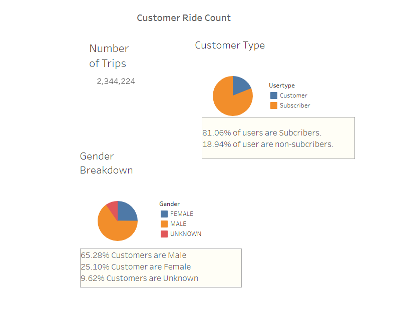
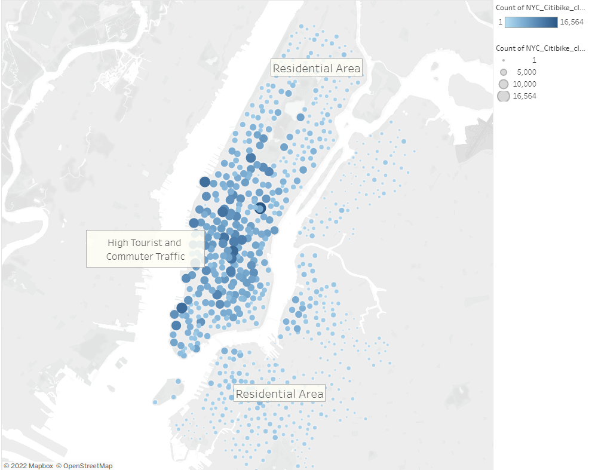
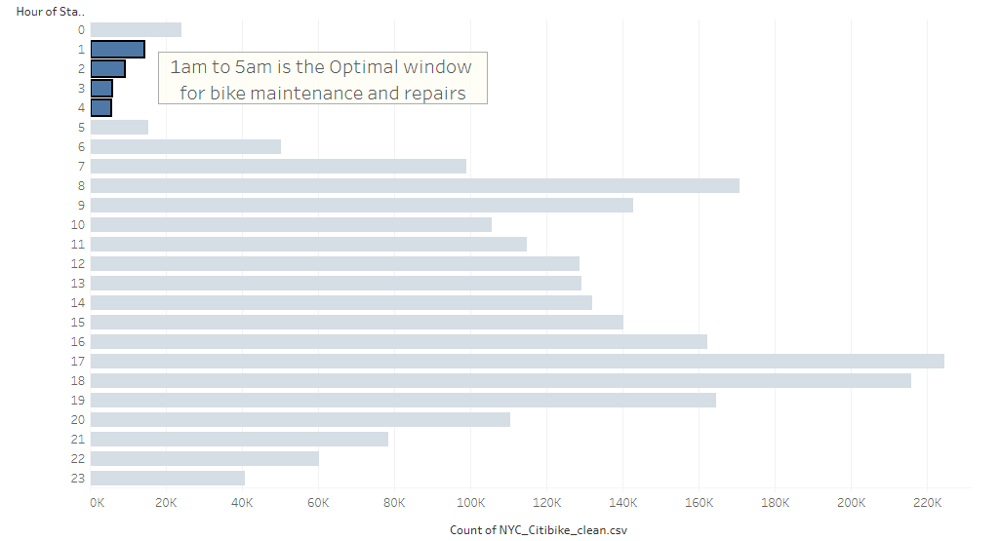
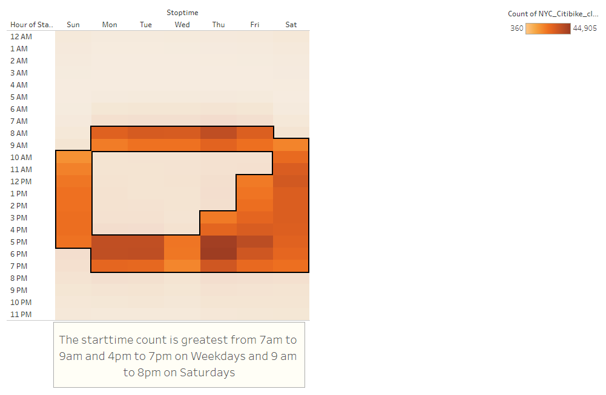
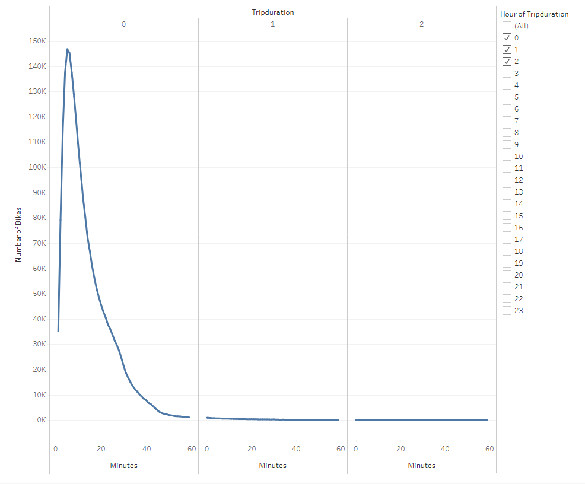
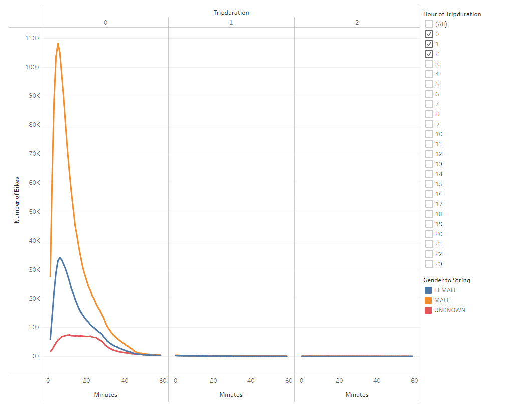
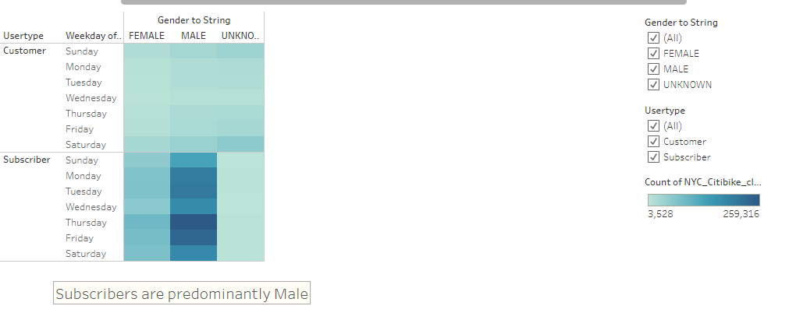

# NYC Citi Bike 
An analysis of NYC CitiBike bikesharing data using Tableau

## Overview of Project:
1. ***Deliverable 1***: Change Trip Duration to a Datetime Format
2. ***Deliverable 2***: Create Visualizations for the Trip Analysis
3. ***Deliverable 3***: Create a Story and Report for the Final Presentation

This Tableau Story can be located [here](https://public.tableau.com/app/profile/matthew.lao/viz/NYC_CitiBike_Challenge_16550494726570/NYCStory)

## Resources and Data:
* Data Source: `201908-citibike-tripdata.csv` and `NYC_Citibike_clean.csv`
* Software: Visual Studio Code 1.67.2 and Tableau Public 2022.1.2
 

## Results:
While the demographics of Des Moines may be different from NYC, a cursory look at the makeup of CitiBike riders may shine light on who bikeshare might appeal to, regardless of locale.
***

In the above image, we can see that 81.06% of the user are **Subcribers**, who make regulare use of the bikes and are a predictable source of income for the program. We can further break down the users by gender and in the image above, we can see that 65.28% users are male, 25.10% are female and 9.62 are unknown. 
***

The above map displays the bike stations from which recorded bike trips started. The size of the circles and darkness of the blue indicate the relative number of trips started at those locattions. It is apparent that the majority of the bike trips originate within Lower Manhattan. Bike is lower in the less denseely packed surrounding neighborhoods. 
***

This chart displays the number of bike rides initiated during each hour of the day for the month of August. We can see the peak hours are during rush hour times, 8am to 9am  and from 5pm to 7pm. We also can see that the least busiest times are between 1am and 5am. This time slot can be used for maintenance and repairs of bikes. 
***

The heatmap above shows us the weekly usage patterns. Once again we can see the busiest bike usage is during the rush hour in the morning and the end-of-day commute. Saturdays also are a busy time for bikesharing. 
***

The graph above shows the majority of trips taken on Citibikes are within 20 minutes in length. Since most trips are under half-hour in length, which means that we don't need as many bikes because of the swift turnover. 
***

This breakdown of number of rides by duration, separated by gender, makes it even more apparent how many more rides are taken by male-identifying customers.
***

Lastly, this heatmap reinforces how much of the userbase is dominated by male-identifying, subscribing users. Why this is the case is unclear and warrants additional study.
***

## Summary:
In conclusion,  bikeshare services are remarkably popular in busy metropolitan areas, where population is densely packed and parking spaces are scarce.  The subscriber count compared to the 'guest' user count is very high at 81.06% which means we can expect regular income to the program. More outreach should be done to attract female riders, but male users seem a reliable market. And main usage seems focused around morning and evening commute times.

If I were to pursue additional lines of inquiry for analysis and visualization, given the data provided, I would explore:

* trip starting and ending locations during morning and evening rush hour time-windows, to display the flow of traffic between neighborhoods at peak hours;
* average trip duration, by birth year, by gender, to explore if there was any difference in male or female or un-gendered riders as they age.